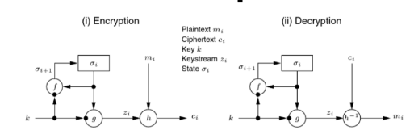
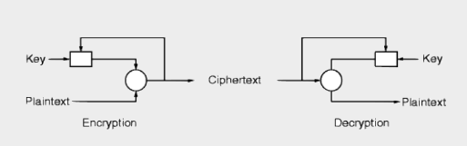

# CIA
**Confidencialidade:**  Restrições que limitam o acesso e divulgação de informação.

**Integridade:** Proteção contra a modificação ou destruição imprópria de informação.

**Disponibilidade:** Garantia de acesso e à informação e possibilidade de usar esse mesma informação.

--- 

# Criptografia
A criptorgafia é uma ferramenta importante da segurança que usa técnicas armazenamento e transmissão de informação para que não haja acessos nao autorizados nem interferências. Defende contra acessos nao autorizados, violação de dados, adulteração e espionagem.

# ACI em Criptografia 
**Confidencialidade:** Garantir que as mensagens são secretas.

**Autenticidade:** Garantir a origem das menssagens.

**Integridade:** As menssagens chegam sem serem adulteradas.

# Conceitos basicos em Criptografia

**Criptoanálise:** Estudo e prática de quebrar códigos e cifras criptográficas com o objetivo de revelar informações secretas protegidas por esses sistemas.

**Criptologia:** Criptorafia + Criptoanalise

**Plaintext/Cleartext:** Conteudo das menssagens.

**Encriptação/Cyphertext/Cryptogram:** Operação que codifica a mensagem.

**Decifração:** Inverso da encriptação.

**Sistema Criptográfico:** Especificação dos algoritmos que realizam uma tecnica criptográfica(como a geração de chaves).

**Ataque:** Compromete a tecnica criptografica como obter a mensagem transmitida sem ter a chave.

**Adversário:** Personificação de um meio hostil.

A segurança de uma cifra deve ser avaliada com a suposição de que todos os detalhes da sua contrução são de conhecimento público.

Uma tecnica criptografica é considerada segura se nenhum dos adversários conseguir atacá-la com sucesso.

# Descrição de um adversário
Relativamente ao controlo que ele tem sobre o canal(ler,escrever):
- **Passivo:** O adversário apenas pode ver o que está a ser transmitido no canal.
- **Ativo:** O adversário tem a capacidade de manipular a informação do canal.

Relarivamente ao poder compotacional:
- **Não computacionalmente limitado**: Adversário que é capaz de executar qualquer algoritmos instantaneamente.
- **Computacionalmente limitado:** Adversário que apenas consegue executar algoritmos com algumas complexidades(PPT-Probabilistic Polynomial Time)

Dependendo do tipo de adversário, podemos ter diferentes definições de segurança:
**Segurança não conditional:** Segurança contra um adversário computacionalmente não limitado.
**Segurança computacional:**Segurança contra um adversário computacionalemente limitado.

# Cifras clássicas

### Cifra de Caesar
A encriptação baseia-se num shift à posição das letras do alfabéto. Neste sentido, o número máximo de chaves possíveis é de 26. Por exemplo,CartagoEstaNoPapo com K=6 resulta em IGXZGMUKYZGTUVGVU.

Como o espaço de chaves possível é muito reduzido, a decriptação baseia-se em tentar todas as possibilidades de chave e ficar com os resultados que facam sentido, o denominado **ataque à força bruta**. Para este tipo de ataques, pressupõe-se que haja redundância suficiente na mensagem original ou que o conteudo da mensagem seja conhecido.

Os analistas por vezes recorrem a uma segunda tática para decifrar, baseada na frequência das letras. Por exemplo, em português, a letra mais comum nos textos de apaercer é o A. Por exemplo, uma alta frequência da letra L levaria a sugerir que o L corresponderia ao A, ou seja, que K=L-A=11.

### Tamanho das chaves
Há de notar que o tamanho das chaves é um critérop necessário(embora não suficiente) para a segurança das cifras. 

O tamanho leva a um crescimento de tempo exponencial para que a cifra seja decifrada. Para termos um nivel razoavel de segurança, usar 2¹¹².

### Cifra de substituição monoalfabética 
Ao invés de dar shift, a cifra passa por fazer uma permutação arbitrária de letras do alfabéto. Por exemplo, dos os A passam a C e todos os B passam a X.

A decifração deste algoritmo passa por analisar a frequencia das letras no alfabéto em que o criptograma foi escrito. Devem se ter também em atenção tuplos de letras como OS, ES, QUE e NAO.

### Cifra de Vigenère (substituição polialfabética)
A chave é uma passeword. Cada letra dessa password corresponde a uma cifra de Ceaser. O seu funcionamento baseia-se em aplicar a cifra de Ceaser a cada caracter da chave a cada correspontente caracter do criptograma.

Temos de ter atenção que neste caso, a mesma letra pode não ser sempre encriptada da mesma forma. Se o plaintext for muito maior que a key, podem se notar padrões.

### Cifra de transposição
Baseado na permutação da posicao dos caracteres.
Consideranco a permutação key=[2,1,3] no plaintext AindaOutraCifra, resultaria em IATCRADUAFNORIA.

### Composição de cifras
Podemos criar cifras misturando outras? Podemos, mas por vezes nao teriam valor. Outros casos são fiáveis como intercalar substituições com permutações.

### One-Time Pad/Cifra de Vernam 
Nesta cifra, o tamanho da chave é no mínimo o tamanho do texto, totalmente aleatória e que apenas é usada uma vez para encriptar. A ideia base é fazer um xor de bits entre os correspondentes entre a chave e o plaintext.

# Propriedades da segurança
A criptografia é usada hoje para garantir mais coisas como:
- **Confidencialidade:** O conteudo da mensage é apenas conhecido por quem tem autorização.
- **Integridade:** Devem ser rejeitadas as mensagens que tenham sido adulteradas/modificadas.
- **Autenticidade:** Garante a origem das mensagens para o destinatário.
- **Não repúdio:** A origem das mensagens não pode ser negada.
- **Anonimato:** Nenhuma informação disponivel sobre a origem da mensagem.
- **Identificação** Estabelecer a identidade de uma parte.

Por vezes, para ter estas propriedades temos de combinar protocolos. Existem **protocolos criptograficos**. Estes espefificam como as trocas de mensagens necessitam de criptografia para alcançar esse objetivo. A segurança desses protocolos depende não apenas da segurança das técnicas criptográficas subjacentes, mas também das interações sutis entre elas.

Podemos definir diferentes niveis de segurança de um sistema que usa criptografia.
- Esquema criptográfico
- Protocolo
- Implementação
- Uso
O uso inadequado de qualquer um destes niveis compromete a segurança de todo o sistema.

# Criptografia simétrica

### Stream Ciphers
Relembrando o OTP, para termos segurança:
- A chaves não podem ser reutilizadas
- As chaves devem ser completamente aleatórias e maiores que o plaintext.
- Não promover difusão, isto é, informações sobre a estrutura da mensagem podem ser usadas para manipula-la.

A ideia basica deste tipo de cifras é usar um gerados de chaves que gere um fluxo de chaves com comprimento arbiytrario a partir de uma chave curta, de tamanho fixo. Neste sentido, a sequẽncia deve ser ciclica. O perido é o comprimento da sequencia. O periodo deve ser o mais longo possivel, finito, sempre maior que o tamanho do plaintext.

As chaves devem ser pseudo randoms e imprevisievis, isto é, deve ser impossivel de determinar o próximo bit.

Relativamnete á sincronidade, o fluxo de chaves é independente da mensagem (**sincronismo**) e é **autosincronizavel**, isto é, capaz de recuperar o sincronismo quando bits sdo texto cifrado sao perdidos.

### Cifras de sequencia sincronizadas
Neste caso, as chaves sao independentes da mensagem. Se introduzirmos bits no criptograma, irá resultar em perda de sincronismo. A transmissao de erros apenas afeta a posicao original da mensagem.

A chave pode afetar:
- A função de próximo estado - f - **Output-Feedbak Mode**
- A função de saída - g - **Counter Mode**
- Ambas

### Cifras de sequencia auto-sincronizaveis

O proximo bit é computado atraves dos ultimos n bits do texto cifrado (e chave).

O IV (**initialisation vector**) é usado para iniciar o processo.

Em caso de erro de trnamissão, a sincronização é restaurada assim que o bit invertido não é mais utilizado para o calculo do próximo bit.

Tem a vulnerabilidade de poder ser possivel atacar por repetição.

### Criptografia Segura com pseudo_random geração de numeros.

**Golomb's Randomness Postulates**
1. A diferença entre o número de 1s e 0s deve tender a zero.
2. O número esperado de sub-sequências de símbolos repetidos (runs) com comprimento l é dado por r(l) = r/2^l.
3. A autocorrelação deve ser um valor constante para qualquer desvio diferente de 0 (módulo p).

**Cryptographic Security**
1. A sequência gerada deve ser indistinguível de uma sequência aleatória para qualquer adversário de Tempo Polinomial Probabilístico (PPT).

### Reutilização de chaves e NONCEs
Criptografar mensagens diferentes com a mesma chave resultará no mesmo fluxo de chave gerado. Esse problema geralmente é superado usando NONCEs — abreviação de "Número usado apenas UMA vez". Um NONCE é um número que nunca deve ser repetido e não é necessário que seja mantido em segredo, ou seja , pode ser enviado com o criptograma.  Na prática, o Nonce é tipicamente uma sequência de bytes gerados aleatoriamente usados durante a criptografia e enviados junto com o criptograma.

### Exemplos de cifras de sequencia
- A5
- E0
- CSS
- RC4
- ChaCha20